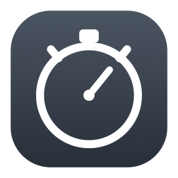

<p align="center">
  
</p>

<h1 align="center">Thyme Custom</h1>

<p align="center">
  A tiny stopwatch, countdown and pomodoro timer that lives in your Mac's menu bar.<br>
  No dock icon, no window, no account. Click the stopwatch, it starts counting.
</p>

<p align="center">
  <a href="https://github.com/Paul10142/thyme-custom/releases/latest"><b>⬇ Download the latest release</b></a>
</p>

---

## Why this exists

[Thyme](https://github.com/joaomoreno/thyme) by João Moreno is a lovely little
menu bar stopwatch that I used for years. It was last updated in 2015 and no
longer runs on Apple Silicon Macs.

This is a fresh reimplementation in Swift: the same idea, running natively on
modern macOS, with a countdown timer and pomodoro cycling added. It is not a
fork — no original source was copied — but it owes the whole concept to Thyme,
and it will import your old Thyme session history automatically on first launch.

## What it does

**Stopwatch.** Click the menu bar icon to start counting up. Click again to
pause and open the menu. Finish saves the elapsed time to your session history
and resets the clock.

**Countdown.** Set hours, minutes and seconds, and choose what happens at zero:
blink in the menu bar, an alert window, a Mac notification, or a spoken
announcement of a phrase you write.

**Pomodoro.** Set a work length, a break length and a number of rounds, and it
alternates automatically until the rounds are done. While it runs, the menu bar
shows a rule **under** the time during work and **over** it during a break, so
you can tell which phase you're in at a glance. Work blocks are recorded in your
history; breaks are not.

**Session history.** The last sessions are listed in the menu with a stopwatch
or hourglass marker showing which timer produced each one, a running total, and
a CSV export for spreadsheets.

**Everything is configurable.** System-wide keyboard shortcuts for every action,
your choice of what a click on the icon does, and automatic pausing while your
Mac sleeps or the screen is locked.

## Install

1. Download `Thyme Custom.dmg` from the
   [latest release](https://github.com/Paul10142/thyme-custom/releases/latest).
2. Open it and drag **Thyme Custom** into your Applications folder.
3. Open it. A stopwatch appears in your menu bar — there is no dock icon and no
   window, which is the point.

### If macOS refuses to open it

This app is **not signed with a paid Apple Developer certificate**, because it's
a free personal project. macOS is suspicious of anything downloaded without one,
so you may see *"Thyme Custom is damaged and can't be opened"* or *"cannot be
opened because the developer cannot be verified"*.

Nothing is actually damaged. Open Terminal, paste this line and press return:

```bash
xattr -dr com.apple.quarantine "/Applications/Thyme Custom.app"
```

That removes the "downloaded from the internet" flag macOS attaches to the file.
Then open the app normally. You only need to do this once.

If you'd rather not use Terminal: go to **System Settings → Privacy & Security**,
scroll down, and click **Open Anyway** next to the message about Thyme Custom.

> Every app on the internet asks you to do this at some point. Only do it for
> software you actually trust — including this one. The source is all here if
> you want to read it, and you can build it yourself instead (see below).

## Using it

| Action | How |
| --- | --- |
| Start / pause the stopwatch | Click the menu bar icon |
| Open the menu | Right-click (or Control-click) the icon |
| Start a countdown | Right-click → **Start General Timer** |
| Start a pomodoro | Right-click → **Start Pomodoro Timer** |
| See your history | Right-click → **Show All Sessions** |
| Change shortcuts and behaviour | Right-click → **Preferences** |

In Preferences you can choose what a plain click does — open the menu, run the
stopwatch, run the countdown, or run the pomodoro — and set system-wide keyboard
shortcuts for each. Shortcuts work from any app. If another app has already
claimed the combination you pick, Thyme Custom tells you rather than silently
doing nothing.

Your sessions live in `~/Library/Application Support/Thyme Custom/sessions.json`.

## Menu bar managers (Ice, Bartender)

If you use a menu bar manager, new icons are usually dropped into its hidden
section, where you'll never find them. Thyme Custom claims a visible position on
first launch to avoid this. If it still hides, drag it into the visible section
in your manager's settings, or ⌘-drag it along the menu bar.

## Building it yourself

You need the Xcode Command Line Tools (`xcode-select --install`). Full Xcode is
not required.

```bash
git clone https://github.com/Paul10142/thyme-custom.git
cd thyme-custom
./Tools/bundle.sh
```

This compiles the Swift sources, assembles `build/Thyme Custom.app`, signs it
ad-hoc, and produces a DMG. Requires macOS 13 or later, Apple Silicon.

## Credits

- [Thyme](https://github.com/joaomoreno/thyme) by
  [João Moreno](https://github.com/joaomoreno) — the original, and the reason
  this exists.
- Countdown and alert options modelled on
  [Menu Bar Countdown](https://github.com/kristopherjohnson/MenuBarCountdown).

MIT licensed. See [LICENSE](LICENSE).
